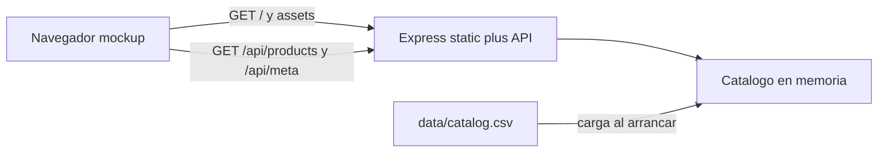

# Conectar vitrina al catálogo vía API Express

El mockup actual ([mockup/app.js](mockup/app.js)) tiene 8 productos hardcodeados, filtros fijos, paginación de adorno (`1 … 504`) y fotos locales. El CSV ([data/catalog.csv](data/catalog.csv)) ya tiene los 4.032 registros con `imageUrl`. El mockup asume **8 productos por página** (4.032 / 8 = 504).

## Arquitectura

Un solo origen: Express sirve [mockup/](mockup/) como estáticos y la API bajo `/api`. Así no hace falta CORS ni abrir el HTML como archivo.

Estructura propuesta:

- [server/package.json](server/package.json) — dependencias: `express`, `csv-parse`
- [server/src/catalog.js](server/src/catalog.js) — parseo y consultas
- [server/src/index.js](server/src/index.js) — rutas y estáticos
- Cambios en [mockup/app.js](mockup/app.js) y [mockup/index.html](mockup/index.html)

## Backend

Al arrancar, leer `data/catalog.csv` **una vez** con `csv-parse` (campos entre comillas y comas en descripciones). Mapear cada fila a:

- mismos campos que el mockup (`id`, `name`, `description`, `format`, `category`, `price`, `priceUnit`, `originalPrice`, `currency`, `productUrl`, `extractedAt`)
- `image` ← `imageUrl` (dejar de usar `assets/*.jpg` para el catálogo real)

Helpers:

- `categoryGroup(category)` = primer tramo antes de `>` (igual que el mockup)
- búsqueda por `name` con `toLocaleLowerCase('es')` e `includes`
- categoría: igualdad del grupo; formato: igualdad exacta
- paginación **después** de filtrar: `pageSize = 8`, `page` base 1

Rutas:

- `GET /api/meta` → `{ categories, formats }` únicos, ordenados (rellenar los `<select>`)
- `GET /api/products?q=&category=&format=&page=` → `{ items, total, page, pageSize, totalPages }`
- `GET /api/products/:id` → un producto o 404 (detalle si no está en la página actual)

Si el CSV no carga: la API responde 500; el frontend muestra el estado de error y “Reintentar”.

Estáticos: `express.static` apuntando a `mockup/`. Script `npm start` en `server/` (puerto p. ej. 3000).

## Frontend

En [mockup/app.js](mockup/app.js):

- Quitar el array `products` de 8 ítems.
- Cargar `/api/meta` y poblar categoría/formato (opción vacía “Todas / Todos”).
- En cada cambio de búsqueda, filtro o página: `fetch('/api/products?...')`.
- Pintar solo `items` de la página; contador tipo `Mostrando 1-8 de 4.032` (o el rango real si hay filtros).
- Paginación funcional: Anterior/Siguiente deshabilitados en extremos; números con página actual, vecinos y última (como el mockup: `1 2 3 … 504`).
- Detalle: usar el ítem de la respuesta o `GET /api/products/:id`; imagen remota.
- Estados reales: `cargando` al fetch, `vacio` si `total === 0`, `error` si falla la red/API. “Limpiar filtros” y “Reintentar” deben funcionar.
- Quitar el panel “Referencia de estados” de [mockup/index.html](mockup/index.html): deja de ser mockup y choca con estados reales.

No hace falta tocar CSS salvo pequeños ajustes de botones de página si pasan de `` a `<button>`.

## Verificación

Arrancar el servidor, abrir la vitrina en el navegador y comprobar:

- Carga inicial: 8 cards, contador 1–8 de 4.032, ~504 páginas.
- Búsqueda por nombre, filtro de categoría/formato y combinación.
- Cambio de página y que el detalle abra con precio CLP e imagen.
- Vacío (búsqueda inexistente) y error (API caída o CSV ausente) + reintento.

Sustituto si el navegador de Cursor no estuviera disponible: `curl` a `/api/meta` y `/api/products`.