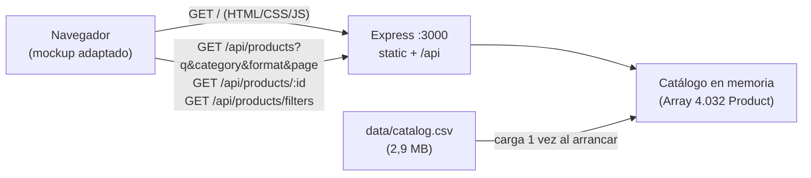
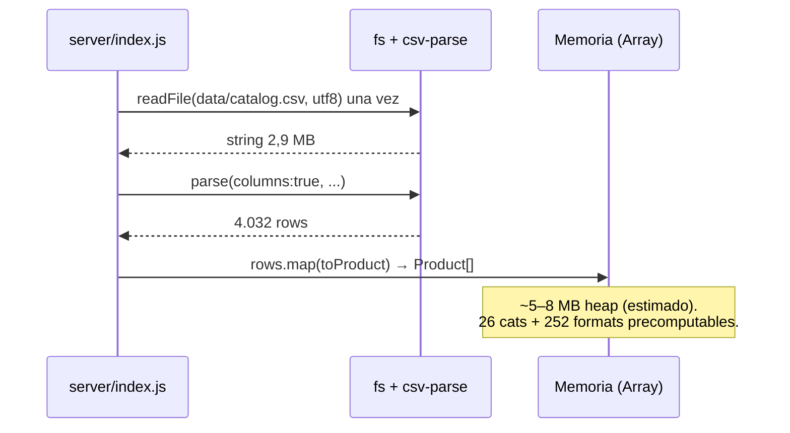

# ARCHITECTURE.md — Vitrina PASO / Catálogo 4.032 productos

> Propuesta de arquitectura derivada de `SPECIFICATION.md` (aprobada).
> Stack simple, sin capas innecesarias, reutilizando el mockup existente.

---

## 1. Decisión de stack

| Capa | Elección | Versión / detalle |
|---|---|---|
| Runtime backend | **Node.js** | 20+ LTS, módulos ESM (`"type": "module"`). |
| Framework HTTP | **Express** | v5. API JSON + estáticos en un solo origen. |
| Parseo CSV | **csv-parse/sync** | Única dependencia extra. Maneja comillas, comas en descripción, `relax_quotes`. |
| Frontend | **HTML + CSS + JS vanilla** | Se adapta `mockup/index.html`, `mockup/styles.css`, `mockup/app.js`. Sin bundler, sin framework. |
| Datos | **`data/catalog.csv` en memoria** | 4.032 filas, 2,9 MB en disco. Sin base de datos. |
| Imágenes | URLs remotas `imgix` tal cual del CSV | Sin proxy, sin descarga local (salvo los 8 `assets/*.jpg` ya existentes solo como fallback offline del mockup). |

No hay TypeScript, bundler (Vite/Webpack), framework SPA (React/Vue/Svelte), SSR (Next/Nuxt),
ORM, base de datos, caché externa, cola, Docker ni CI/CD en esta fase.

### Estructura de carpetas (propuesta, coincide con lo existente)

```text
tarea-main/
  SPECIFICATION.md
  ARCHITECTURE.md
  data/
    catalog.csv
    README.md
  mockup/              # frontend (se adapta, no se reescribe)
    index.html
    styles.css
    app.js
    assets/            # solo 8 imágenes de ejemplo offline
  server/
    package.json       # express, csv-parse
    src/
      index.js         # bootstrap + rutas + estáticos
      catalog.js       # carga CSV + query + meta + findById
```

Si el revisor prefiere separar `public/` de `mockup/`, basta renombrar `mockup/` a
`public/` o apuntar `express.static` a otro directorio. No se propone por ahora para
minimizar diff.

---

## 2. Arquitectura general

Un solo proceso Node sirve todo (mismo origen → sin CORS):



### Por qué un solo origen

- `express.static(mockup/)` + `/api/*` en el mismo puerto elimina CORS, preflights y
  configuración de proxy en desarrollo.
- Despliegue trivial: `npm start` en `server/` (`PORT=3000` por defecto).
- El frontend usa `fetch('/api/...')` relativo, sin variables de entorno.

---

## 3. Separación de responsabilidades

### 3.1 Backend (`server/src/`) — dueño de los datos y las reglas de filtrado

**`catalog.js` (lógica pura, sin Express):**

- `loadCatalog(csvPath)`: lee el CSV una vez, parsea con `csv-parse/sync`
  (`columns:true, skip_empty_lines, relax_quotes, relax_column_count`), mapea cada fila
  con `toProduct()` (`imageUrl → image`, `Number(price)`, `String(id)`), filtra filas sin `id`.
- `categoryGroup(category)`: `split(' > ')[0]`. Única regla de agrupación de categoría.
- `matchesFilters({q, category, format})`: `q` contra `name` (`trim + toLocaleLowerCase('es') + includes`, AND con categoría exacta de grupo y formato exacto).
- `queryProducts(products, {q, category, format, page})`: filtra → `total` → `totalPages = ceil(total/8)` → `clamp(page)` → `slice` de 8. Devuelve `{items, total, page, pageSize: 8, totalPages}`.
- `getMeta(products)`: 26 `categories` + 252 `formats` únicos, ordenados con `Intl.Collator('es', {sensitivity:'base'})`.
- `findProduct(products, id)`: igualdad estricta `String(id)`.
- `PAGE_SIZE = 8` como única constante de paginación.

**`index.js` (HTTP + bootstrap, sin lógica de negocio):**

- Resuelve rutas (`data/catalog.csv`, `mockup/`), carga el catálogo con top-level `await`, guarda `loadError` si falla.
- Middleware `requireCatalog`: si hubo error o array vacío → `500 {error: "No se pudo cargar el catálogo"}` en toda `/api/*`.
- Rutas:
  - `GET /api/products` → normaliza `q/category/format/page` (`parseInt || 1`) y delega a `queryProducts`.
  - `GET /api/products/:id` → `findProduct`, `404 {error: "Producto no encontrado"}` si no existe.
  - `GET /api/products/filters` (canónica según SPEC; mantener `GET /api/meta` como alias temporal por compatibilidad con el mockup actual) → `getMeta`.
- `express.static(mockupDir)` al final (las rutas `/api` tienen prioridad).
- `app.listen(PORT)`. Sin auth, sin rate-limit, sin compresión obligatoria.

El backend **no** formatea moneda, no pagina en cliente, no ordena, no hace fuzzy-search.
Devuelve datos crudos + metadatos de paginación; el formato (`$2.605`, `4.032`) es del frontend.

### 3.2 Frontend (`mockup/` adaptado) — dueño del estado UI y el render

- **Estado local** (`app.js: state`): `{q, category, format, page, total, totalPages, items, loading, error}`. `PAGE_SIZE = 8` solo para calcular el rango `Mostrando X-Y` (la autoridad es `pageSize` del servidor).
- **Arranque (`boot`)**: `loading=true` → `GET /filters` (pobla los dos `<select>` con opción `""`) → `GET /products` → render.
- **Interacción**: `input` en buscador/selects → `page=1` → refetch; `Anterior/Siguiente/número` → `page±` → refetch. Usa la `page` normalizada que devuelve el servidor.
- **Render**: `renderGrid()` (único punto de pintura: `loading → error → vacío → datos`), `renderPagination()` (oculta si `loading/error/total===0/totalPages<=1`, ellipsis `1 2 3 … 504`), `productCard()` y `openDetail()` (modal `<dialog>` con caché de página + fallback a `GET /:id`).
- **Estados**: plantillas `cargando / vacio (Limpiar filtros) / error (Reintentar)` + texto de `#result-count`. Sin librerías: `fetch` nativo, `Intl.NumberFormat('es-CL')`, `<dialog>.showModal()`.
- **Lo que no hace**: no filtra ni pagina localmente (siempre pide al servidor), no guarda estado en URL, no cachea más allá de la página actual.

Límite explícito: `mockup/app.js` actual no tiene debounce; se mantiene en v1 por simplicidad (cada `input` = 1 fetch barato). Si el revisor lo pide, se añade debounce 250 ms solo en frontend, sin tocar el backend.

---

## 4. Procesamiento del CSV: eficiente sin sobredimensionar

### 4.1 Carga única al arrancar (no por request)



- Costo único de arranque: < 200 ms en máquina normal; despreciable frente al uptime.
- Si falla (archivo ausente, permiso, CSV corrupto): no se reintenta por request; se fija `loadError` y toda la API responde `500` hasta reiniciar el proceso. El frontend muestra estado de error + `Reintentar` (que reintenta el fetch, no la recarga del archivo).
- Sin `watch`/hot-reload del CSV: para actualizar datos se reemplaza el archivo y se reinicia (`npm start`). Suficiente para un catálogo estático de curso.

### 4.2 Memoria: por qué el array en memoria es suficiente

- Disco: 2.936.547 bytes (~2,9 MB).
- Heap estimado: cada `Product` (~12 campos string/number + URLs largas) ≈ 1–2 KB → **~4–8 MB** totales. Un orden de magnitud por debajo del heap por defecto de Node (~512 MB–2 GB).
- Sin duplicación: un solo `Array` compartido por referencia; `filter` crea un array de referencias por request (no clona objetos), `slice(8)` devuelve solo la página. El GC libera el array filtrado tras serializar.
- `getMeta` recorre el array una vez por request (`O(n)` con dos `Set`); con `n=4.032` es < 1 ms. No requiere caché, pero se puede memoizar si se quiere (ver §6).

### 4.3 Búsqueda y paginación por request: `O(n)` trivial

Por cada `GET /api/products`:

1. `products.filter(matchesFilters)` — un pase lineal `O(4.032)`, ~0,1–0,5 ms. Sin índice invertido, sin regex, sin DB.
2. `Math.ceil(total/8)` + `clamp` + `slice(start, start+8)` — `O(1)`.
3. `res.json({items: 8, total, page, pageSize, totalPages})` — serializa solo 8 objetos (~10–20 KB), no los 4.032.

Concatenar `q + category + format` en AND no necesita optimización: el prefiltro más selectivo no se ordena porque el costo ya es despreciable. `findProduct` por `id` es `O(n)` lineal (~4.032 comparaciones string); igualmente < 1 ms, sin necesidad de `Map`.

**Escala**: este diseño aguanta sin cambios hasta ~50k–100k filas en una instancia pequeña. Más allá (millones, búsqueda full-text, facetas pesadas), el camino sería SQLite FTS o motor externo — explícitamente fuera de alcance aquí.

### 4.4 Por qué no streaming ni paginación a disco

- Hacer `stream` del CSV por request releería y reparsearía 2,9 MB en cada búsqueda: más I/O y CPU que filtrar el array ya parseado.
- Paginar a disco (leer líneas N–M) impediría filtrar antes de paginar (hay que filtrar todo para conocer `total`).
- La solución correcta para este volumen es **parsear una vez, filtrar en memoria, serializar solo la página**.

---

## 5. Justificación: por qué este stack y no otro más complejo

| Alternativa rechazada | Por qué se rechaza aquí |
|---|---|
| Base de datos (SQLite/Postgres/Mongo) + ORM | Añade instalación, migraciones, seed del CSV y consultas SQL por un dataset estático de 2,9 MB que cabe en memoria y ya cumple `total/page/slice` en < 1 ms. Costo sin beneficio. |
| Motor de búsqueda (Meilisearch/Typesense/Elastic) | Justificado para fuzzy-search, tolerancia a tildes o millones de docs. La SPEC exige `includes` exacto solo en `name`. Sería un servicio extra que operar. |
| Frontend SPA (React/Vue/Svelte) + bundler | La UI es grilla + 2 selects + paginación + 1 modal + 3 estados: ~300 líneas vanilla ya existentes. Un framework añadiría build, dependencias y curva sin aportar routing ni estado complejo. |
| SSR / Next.js / Nuxt | Sin SEO dinámico ni render inicial crítico que lo exija; el catálogo se hidrata por fetch. SSR duplicaría el render sin mejorar la tarea (búsqueda/filtros/paginación). |
| Redis / caché HTTP / CDN | `GET /products` ya responde en ms con payload de 8 items; `GET /filters` es igualmente barato. Cachear añadiría invalidación sin problema real de carga. |
| GraphQL / tRPC / validación pesada (Zod) | Contrato de 3 endpoints GET con 4 query params opcionales y clamp benigno (no 400). Un schema GraphQL o validador es sobrediseño. |
| Docker / K8s / CI obligatorios | Útil para producción real, innecesario para el ejercicio (`node src/index.js`). Se puede añadir después sin cambiar código. |
| Auth / CORS / rate-limit | Mismo origen, catálogo público de lectura, sin escritura. Se añaden solo si el alcance crece. |

**Principio aplicado**: la solución más simple que cumple la SPEC aprobada — un proceso, dos dependencias, cero build — es la más fácil de revisar, ejecutar (`npm start` → `http://localhost:3000`) y corregir. Toda capa extra se propone como evolución futura (§6), no como requisito.

---

## 6. Riesgos, límites y evolución (no implementados en v1)

- **Alias `/api/meta`**: mantenerlo temporalmente junto a `/api/products/filters` evita romper el mockup actual; eliminar en cuanto el frontend migre.
- **Imágenes remotas**: si `imgix` cae, las cards quedan con `img` roto. Mejora futura: `onerror` con placeholder local, `loading="lazy"`.
- **Sin debounce / sin URL state**: cada tecla dispara fetch; recargar pierde filtros. Mejoras opcionales solo-frontend, sin impacto API.
- **Memoizar `/filters`**: el cálculo es < 1 ms, pero se puede cachear el objeto tras la carga si se quiere evitar el recorrido por request.
- **Si el catálogo creciera ×20**: migrar `products` a SQLite (`FTS5` para `name`) manteniendo el mismo contrato JSON; el frontend no cambiaría.

---

## 7. Decisiones de Seguridad y Robustez

Medidas consolidadas (ver §4.5 de `SPECIFICATION.md` y suite `server/tests/api.test.js`):

- **XSS en frontend (`mockup/app.js`)**: todo texto dinámico de la API que se inyecta
  vía `innerHTML` (`productCard`, `fillSelect`, `#detail-list`) pasa por `escapeHTML()`
  (`&<>"'`). Los demás puntos ya eran seguros: `textContent` y asignación de
  propiedades (`.src`/`.href`). No se usa `innerHTML` con datos sin sanear.
- **Race conditions (`mockup/app.js`)**: `loadProducts()` usa `AbortController` — cada
  búsqueda/filtro/página aborta el fetch anterior y descarta respuestas obsoletas
  (doble resguardo: `signal` + comparación de controlador vigente). Un `abort` no
  muestra estado de error. `refreshFormats()` conserva su guardián por ticket.
- **Validación de parámetros (backend, fuente única en `server/src/catalog.js`)**:
  `sanitizeSearch()` (`trim` + tope 100 caracteres), `normalizePagination()`
  (`page` entero `>= 1`, `limit` 1–50 con tope). Entradas maliciosas o absurdas
  (`?page=abc`, `?limit=9999`, `<script>` en `search`/`:id`) degradan a
  defecto/clamp/404 — nunca a 500. Se eligió sanitizar en `catalog.js` (no en la
  capa HTTP) para que la lógica sea testeable sin servidor.
- **Cabeceras seguras**: toda respuesta incluye `X-Content-Type-Options: nosniff`,
  `X-Frame-Options: DENY` y `Referrer-Policy: strict-origin-when-cross-origin`,
  sin dependencias extra (sin `helmet`, innecesario para 3 cabeceras estáticas).
- **Observabilidad mínima**: `GET /api/health` → `200 { status, totalProducts, timestamp }`,
  sin `requireCatalog` para que el monitoreo funcione incluso con el CSV caído.
- **Errores seguros**: los 500 responden mensajes genéricos fijos; existe manejador
  Express de 4 argumentos que registra el detalle en consola del servidor y nunca
  devuelve `stack` al cliente. Rutas `/api/*` desconocidas → `404` JSON (no HTML).

*Fin de arquitectura — siguiente paso: implementación conforme a SPEC + esta arquitectura.*
